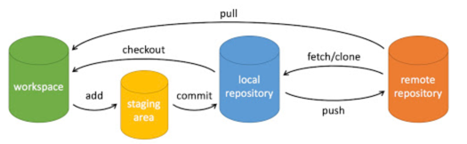

# git
## 使用总结
- 基本操作
  - git clone
  - git push
  - git pull
  - git add
  - git commit
  - git checkout
    

- 新建仓库
  - git init
  - git clone

## 参考
- git基本操作：https://www.runoob.com/git/git-basic-operations.html
